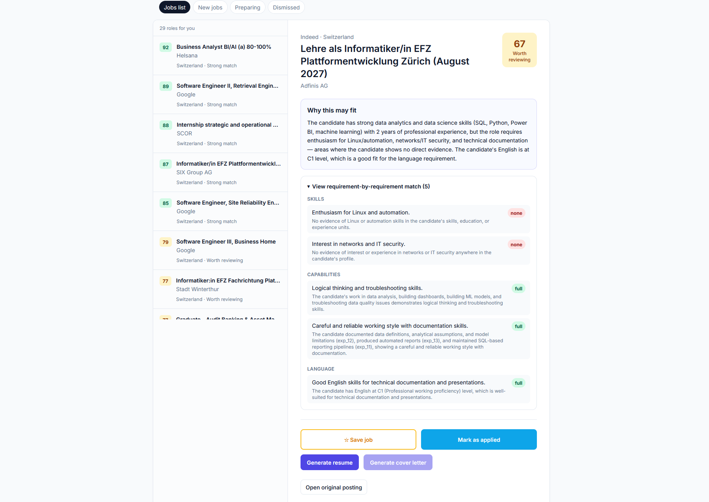
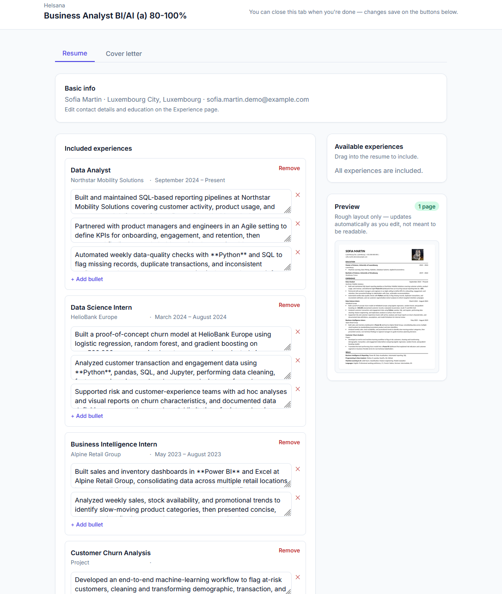
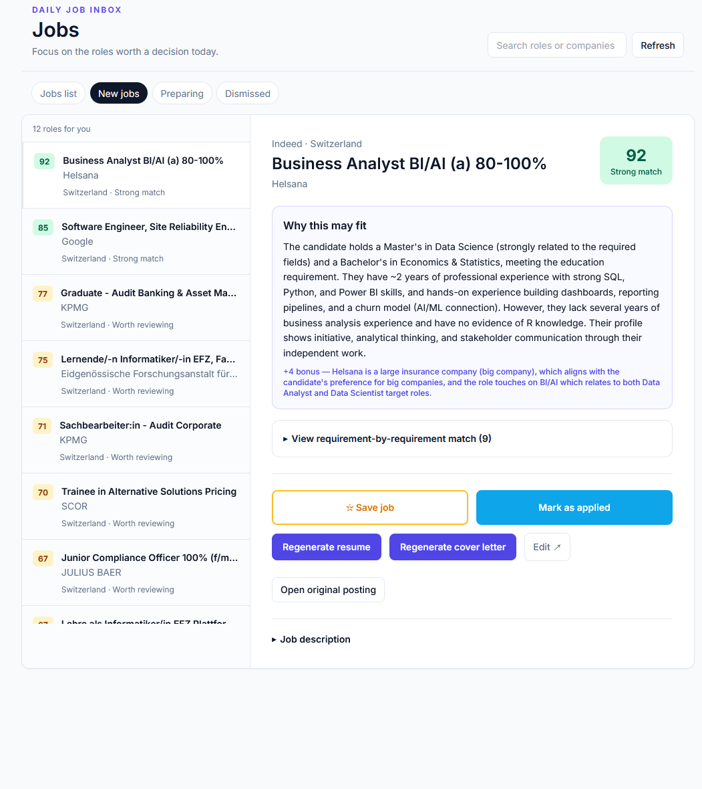
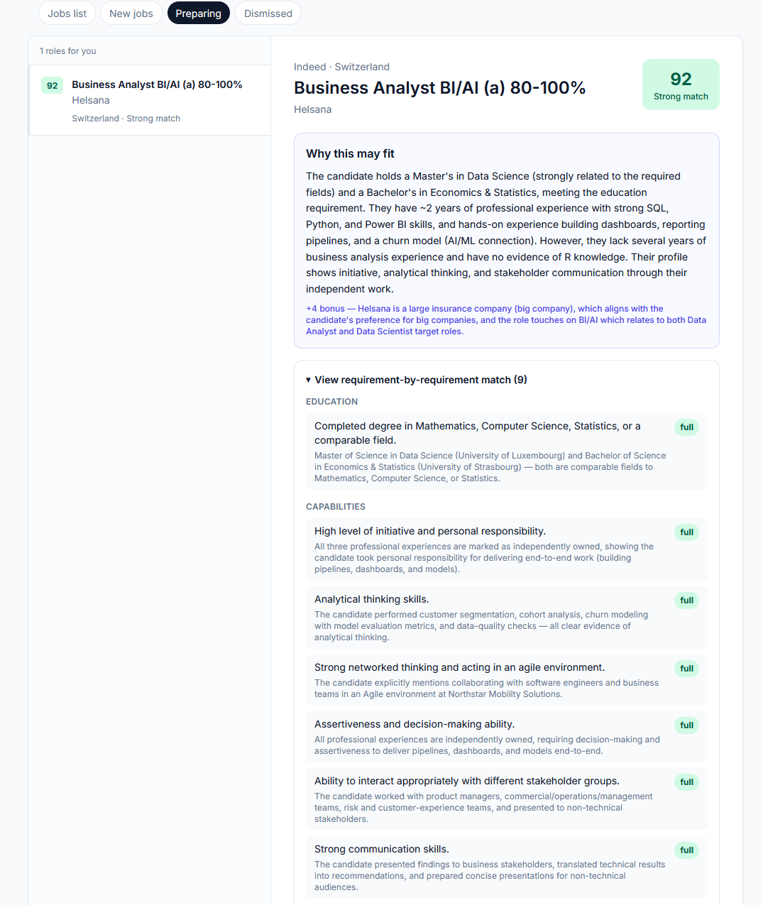
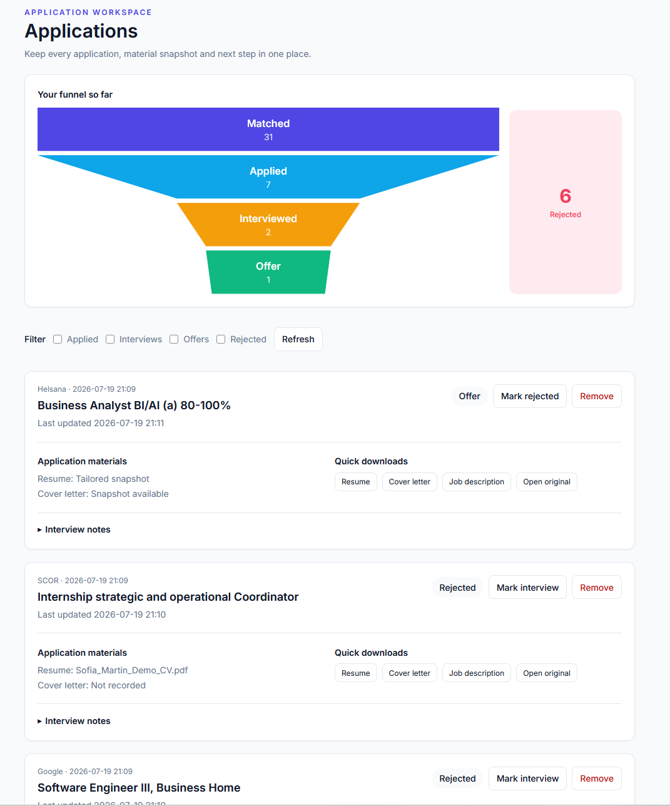

<div align="center">

# JobMatchFlow

### Find jobs that actually match you.

AI-powered job discovery, CV–job matching, tailored application materials, and application tracking in one workflow.

[Live Demo](#) · [Product Overview](#how-it-works) · [Report an Issue](../../issues)

[](https://github.com/leoqingyu/jobmatchflow-public/actions/workflows/ci.yml)
[](LICENSE)


</div>

---

<p align="center">
  
</p>

## What is JobMatchFlow?

JobMatchFlow is an AI-powered job search and application assistant.

Instead of browsing hundreds of loosely relevant vacancies, users define their target roles, locations, experience level, and career preferences. JobMatchFlow then helps them discover suitable opportunities, understand their fit, prepare tailored application materials, and track each application.

The project is currently focused on international job seekers and supports a workflow that can be expanded across European and North American job markets.

## How it works

```text
Discover jobs
      ↓
Normalize and organize vacancies
      ↓
Match each job against the user's master CV
      ↓
Explain strengths, gaps, and application priority
      ↓
Generate tailored application materials
      ↓
Track applications and follow-ups
```

## Core features

### Job discovery

Collect and organize relevant opportunities based on role, location, seniority, and user preferences.

### CV–job matching

Evaluate how well a candidate's experience matches each job description and provide an explainable fit assessment.

### Application prioritization

Help users distinguish between strong matches, realistic opportunities, and low-priority applications.

### Tailored application materials

Prepare job-specific resume content and cover letters using the user's master career profile. For each job, JobMatchFlow rewrites and reorders the relevant bullet points from the user's master CV to foreground the experience that matches that specific posting, rather than sending the same static resume everywhere.

<p align="center">
  
</p>

### Application tracking

Manage saved jobs, application status, generated documents, deadlines, and follow-up actions in one place.

## Product preview

| Job discovery                                   | Match analysis                                    | Application tracking                                          |
| ----------------------------------------------- | ------------------------------------------------- | ------------------------------------------------------------- |
|  |  |  |


## Why JobMatchFlow?

Traditional job boards optimize for the number of listings displayed. JobMatchFlow is designed around a different question:

> Which opportunities are genuinely worth this person applying to?

The platform combines job discovery with personalized evaluation, helping users spend less time reviewing irrelevant positions and more time preparing high-quality applications.

## Repository scope

This repository contains a self-hostable reference implementation of
JobMatchFlow, including the FastAPI backend, React frontend, AI matching
workflow, document generation, application tracking, and a replaceable
example job-source connector.

Production infrastructure, production data sourcing, credentials, and
real user data are maintained separately.

> **Note on job sourcing:** the bundled scraper (`scraper/providers/jobspy_provider.py`)
> is a minimal reference implementation on top of the open-source
> [`python-jobspy`](https://pypi.org/project/python-jobspy/) library. It's here as a
> placeholder to make the pipeline runnable end-to-end out of the box — it is not a
> description of how the production service actually sources its job data. Feel free
> to use it as-is, or swap in your own provider via the interface in `scraper/base.py`.

Not included, for obvious reasons: real user data, production credentials, and
any `.env` file. See `.env.example` in the repo root for the full list of
configuration variables you need to supply yourself.

## Project structure

```text
ai/         LLM clients, scoring, JD extraction, resume rewriting
api/        FastAPI apps (user_app.py is the main entrypoint) and route modules
core/       Settings, logging, shared constants and utilities
db/         SQLAlchemy models and Alembic migrations
notifier/   Email notifications
renderer/   HTML → PDF/DOCX rendering
scraper/    Job board connectors (JobSpy)
services/   Business logic (ingestion, scoring, tracking, generation, ...)
storage/    Pluggable file storage (local disk today, S3-ready interface)
tasks/      Scheduled/background task definitions
scripts/    Standalone entrypoints for workers and maintenance scripts
frontend/   React + TypeScript + Vite single-page app
```

## Technology overview

JobMatchFlow is built with a modern web application stack:

* **Frontend:** React, TypeScript and Vite
* **Backend:** Python and FastAPI
* **Database:** PostgreSQL
* **AI workflow:** Large language models for job analysis and application assistance
* **Document generation:** HTML and PDF application materials

The production architecture may evolve independently from the public demonstration repository.

## Local development

### Requirements

* Python 3.11+
* PostgreSQL 14+
* Node.js 20+ and npm
* At least one LLM API key (Gemini, Claude, DeepSeek, or Qwen — see below)
* Optional: Playwright browsers (for the `chromium` PDF engine), LibreOffice
  (`soffice`, used only to sanity-check DOCX page counts — the app degrades
  gracefully if it isn't installed)

### 1. Clone and install the backend

```bash
git clone https://github.com/leoqingyu/jobmatchflow-public.git
cd jobmatchflow-public

python3 -m venv .venv
source .venv/bin/activate

pip install -r requirements.txt
# Optional: enables local embedding-based job de-duplication
pip install -r requirements-embed.txt

# Only if you use the default chromium PDF engine
playwright install chromium
```

### 2. Configure environment variables

```bash
cp .env.example .env
```

Edit `.env` and fill in at minimum `DATABASE_URL` and one LLM API key. Every
variable is documented inline in `.env.example` and maps 1:1 to a field on
`Settings` in `core/config.py`.

### 3. Set up the database

```bash
createdb jobmatchflow   # or point DATABASE_URL at an existing database
alembic upgrade head
```

### 4. Run the API

```bash
uvicorn api.user_app:app --host 0.0.0.0 --port 8000 --reload
```

The API serves Swagger UI at `/docs`. Once the frontend is built (see below),
`/` redirects to the bundled SPA at `/app/`; until then it redirects to `/docs`.

### 5. Run the frontend

```bash
cd frontend
npm install
npm run dev
```

Open the local address Vite prints. In dev mode, requests to `/api/*` are
proxied to `http://127.0.0.1:8000` (see `frontend/vite.config.ts`) — the
frontend has no environment variables of its own to configure.

For a production build served directly by the FastAPI app:

```bash
npm run build   # outputs to frontend/dist, auto-served at /app by api/user_app.py
```

### 6. Optional background workers

These are separate long-running processes; run any subset depending on which
parts of the pipeline you want active. Each is a plain Python script (no
process manager included — use `systemd`, `supervisor`, `tmux`, or similar for
anything long-lived):

```bash
python scripts/run_scheduler.py          # keyword-driven job scraping, on a schedule
python scripts/run_matching_worker.py    # per-job scoring + asset generation
```

Do not place real API keys, credentials, cookies, access tokens, or production
URLs in any committed file — only in your local, gitignored `.env`.

## Project status

JobMatchFlow is live in Founder Beta.

The hosted version currently supports:

* Career profile setup
* Daily job discovery
* Explainable CV–job matching
* Tailored resume and cover-letter generation
* Application tracking

Production job sourcing and infrastructure are maintained separately
from this public reference implementation.

## Feedback

Feedback, product ideas, and bug reports are welcome through GitHub Issues.

When reporting a problem, please do not include:

* Personal resumes
* Private job application documents
* API keys or access tokens
* Authentication cookies
* Private company or user data

## About the project

JobMatchFlow is being developed as a practical AI assistant for people managing complex, multi-market job searches.

The goal is not to automate indiscriminate mass applications. It is to help users identify better opportunities, understand their positioning, and prepare stronger applications.

## License

JobMatchFlow is licensed under the [GNU Affero General Public License v3.0](LICENSE).

In short: you're free to use, modify, and self-host this code, including
commercially, as long as any modified version you run as a network service is
also made available under AGPL-3.0 — including to users interacting with it
only over a network. See the [LICENSE](LICENSE) file for the full legal text.

---

<div align="center">

**JobMatchFlow — Discover better matches. Prepare stronger applications.**

</div>
